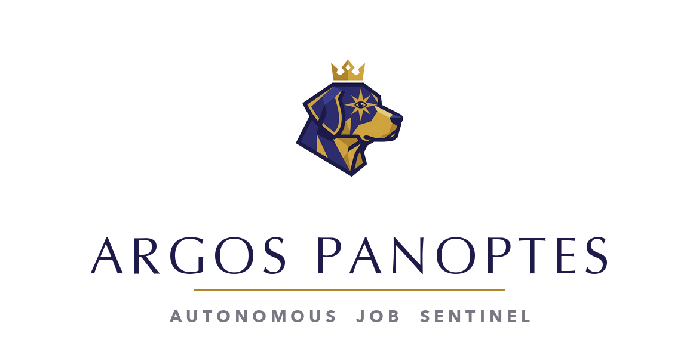
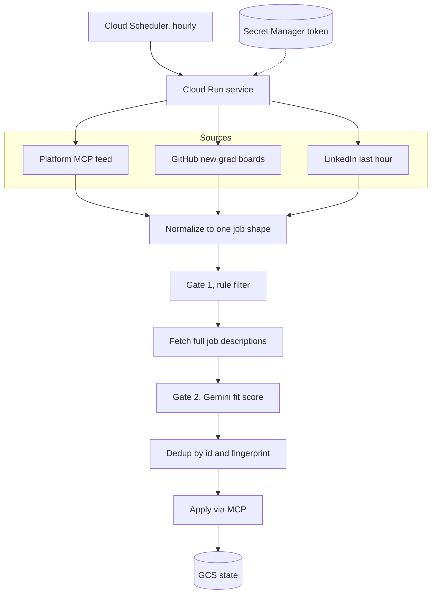
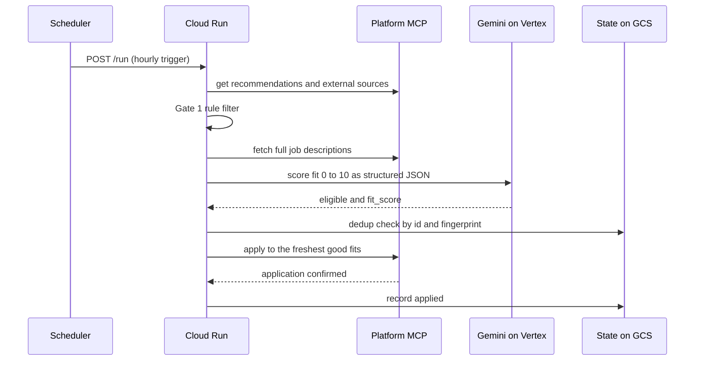
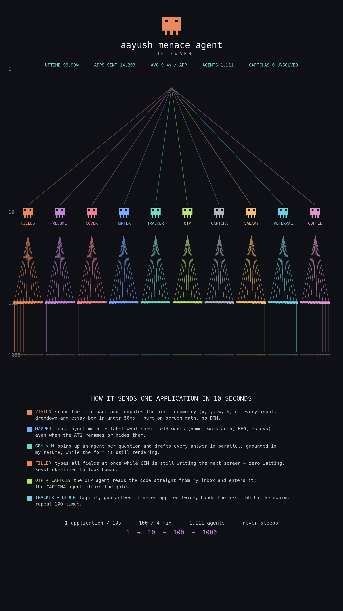

<div align="center">



**An autonomous, multi source job application agent that watches every board with a hundred eyes, filters with a two gate pipeline, and applies to genuine fits around the clock.**


</div>

---

## Overview

Argos Panoptes named after the hundred eyed watchman of Greek myth is a serverless agent that runs every hour, pulls fresh postings from several job sources, filters them through a rules gate and a model gate, removes duplicates across sources, and submits applications only to roles that are a genuine fit. It runs entirely in the cloud so it works with the laptop closed.

The design goal is capture, not spray. The agent aims to catch essentially every good new grad role that exists while refusing to apply to anything that does not clear a real quality bar.

## Architecture



## How one application flows



## Job sources

| Source | What it adds | Auth |
| --- | --- | --- |
| Platform MCP feed | The vendor recommendation feed | OAuth |
| SimplifyJobs, vanshb03, cvrve | Structured new grad boards with real ATS apply URLs | None |
| LinkedIn last hour | The freshest postings, date sorted | None |

Every source is normalized into one common job shape on ingest, so a single pipeline, a single filter, and a single dedup layer serve all of them.

## The two gate filter

**Gate 1** is a cheap rule pass with zero token cost. It fast fails senior and staff titles, internships, explicit no sponsorship or citizenship only roles, basic IT and non engineering roles, and anything that does not read as a software role.

**Gate 2** is a Gemini model on Vertex AI that scores each survivor from 0 to 10 on genuine fit and re checks the dealbreakers against the full job description. Only eligible roles at or above the score threshold are kept, ranked newest first.

## Stack

| Layer | Technology |
| --- | --- |
| Runtime | Python on Cloud Run |
| Schedule | Cloud Scheduler, hourly |
| Model | Gemini on Vertex AI |
| Integration | Model Context Protocol (MCP) over OAuth |
| Secrets | Secret Manager with token write back |
| State | Google Cloud Storage |

## Deploy

```bash
gcloud run deploy argos-panoptes \
  --source . \
  --region us-central1 \
  --project <your-project>
```

Runtime configuration is environment driven, including the source list, the recency window, the score threshold, and the daily cap. See `DECISIONS.md` for the reasoning behind each architectural choice.

## Project layout

| File | Role |
| --- | --- |
| `main.py` | FastAPI entrypoint, the `/run` and `/state` endpoints |
| `pipeline.py` | Orchestration, pull to filter to apply |
| `sources.py` | External source adapters, normalized on ingest |
| `gate1.py` | Rule based hard exclusions |
| `gate2.py` | Gemini fit scorer |
| `mcp_client.py` | MCP client wrapper and token handling |
| `state.py` | Dedup and daily cap state |
| `profile.py` | Candidate profile and role priorities |

## The Swarm

A stylized rendering of the agent as a recursive swarm. Artistic, not the literal architecture.

<div align="center">

</div>

## License

MIT. See [LICENSE](LICENSE).
